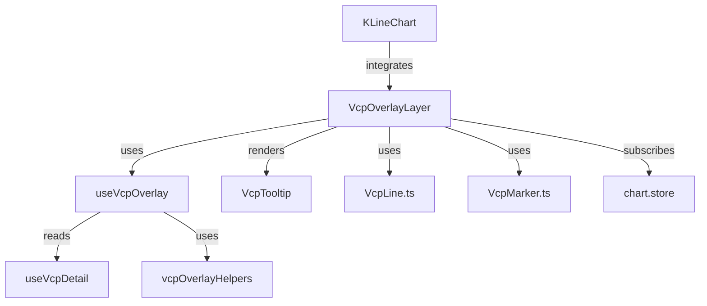

# Quick Start: VCP K-Line Chart Overlay 开发指南

**Feature**: 006-vcp-kline-overlay  
**Date**: 2026-03-14  
**Phase**: 1 - Design & Contracts

本指南帮助开发者快速上手 VCP 叠加层功能的开发、测试和集成。

---

## 1. 开发环境设置

### 1.1 前置条件

```bash
# 检查 Node.js 版本 (frontend 需要 18+)
node --version  # 应显示 v18.x 或更高

# 检查 npm 版本
npm --version   # 应显示 8.x 或更高
```

### 1.2 安装依赖

```bash
cd /Users/youxingzhi/ayou/money-free/frontend
npm install
```

### 1.3 启动开发服务器

```bash
# Terminal 1: 启动 frontend dev server
cd frontend
npm run dev
# 访问 http://localhost:5173

# Terminal 2: 启动 backend (如需测试 VCP API)
cd backend
npm run start:dev
# 监听 http://localhost:3000
```

---

## 2. 项目结构导航

### 2.1 关键文件位置

```text
frontend/src/
├── components/
│   └── KLineChart/
│       ├── index.tsx                   # 现有图表组件（需修改）
│       ├── VcpOverlayLayer.tsx         # [NEW] 主叠加层组件
│       ├── VcpLine.ts                  # [NEW] 线条绘制逻辑
│       ├── VcpMarker.ts                # [NEW] 标记点逻辑
│       └── VcpTooltip.tsx              # [NEW] Tooltip 组件
├── hooks/
│   └── useVcpOverlay.ts                # [NEW] 核心逻辑 hook
├── types/
│   └── vcp.ts                          # [MODIFY] 添加叠加层类型
├── store/
│   └── chart.store.ts                  # [MODIFY] 添加 toggle 状态
└── utils/
    └── vcpOverlayHelpers.ts            # [NEW] 工具函数

tests/
├── components/
│   └── KLineChart/
│       ├── VcpOverlayLayer.test.tsx    # [NEW] 组件测试
│       └── ...
└── hooks/
    └── useVcpOverlay.test.ts           # [NEW] Hook 测试
```

### 2.2 依赖关系



---

## 3. 开发工作流

### 3.1 TDD 工作流 (Test-Driven Development)

```bash
# Step 1: 编写测试
vim frontend/tests/components/KLineChart/VcpOverlayLayer.test.tsx

# Step 2: 运行测试（应该失败）
cd frontend
npm run test -- VcpOverlayLayer.test.tsx

# Step 3: 实现功能（让测试通过）
vim frontend/src/components/KLineChart/VcpOverlayLayer.tsx

# Step 4: 重新运行测试
npm run test -- VcpOverlayLayer.test.tsx

# Step 5: Refactor（保持测试通过）
# ...

# Step 6: 运行所有测试
npm run test
```

### 3.2 开发顺序建议

**Phase 2.1: 核心渲染逻辑** (2-3 天)
1. ✅ 创建 `VcpLineData` 类型 (`types/vcp.ts`)
2. ✅ 实现 `useVcpOverlay` hook（数据转换 + 过滤）
3. ✅ 实现 `VcpLine.ts`（Canvas 绘制逻辑）
4. ✅ 实现 `VcpOverlayLayer` 组件（Series Primitives 集成）
5. ✅ 测试：线条正确渲染，颜色正确，位置对齐

**Phase 2.2: 交互功能** (1-2 天)
6. ✅ 实现 Hit Detection（线条悬停检测）
7. ✅ 实现 `VcpTooltip` 组件（内容格式化 + 边界检测）
8. ✅ 集成 Tooltip 到 VcpOverlayLayer
9. ✅ 测试：悬停显示正确信息，边界检测有效

**Phase 2.3: 控制与状态** (1 天)
10. ✅ 扩展 `chart.store.ts`（添加 `vcpOverlayVisible`）
11. ✅ 实现 `VcpOverlayControl` 组件（Toggle 按钮）
12. ✅ 集成 Toggle 到 ChartToolbar
13. ✅ 测试：Toggle 工作，状态持久化

**Phase 2.4: 优化与边缘情况** (1 天)
14. ✅ 性能优化（Visible Range Filtering）
15. ✅ 处理边缘情况（无 VCP 数据、加载中、10+ 线条）
16. ✅ 测试：性能符合标准（< 500ms 渲染，60 FPS 交互）

**Phase 2.5: 测试与文档** (1 天)
17. ✅ 集成测试（E2E scenario）
18. ✅ 文档（组件注释、README 更新）
19. ✅ Code Review 自查
20. ✅ 提交 PR

---

## 4. 常用命令

### 4.1 测试命令

```bash
# 运行所有测试
npm run test

# 运行特定文件测试
npm run test -- VcpOverlayLayer.test.tsx

# 监听模式（自动重跑）
npm run test -- --watch

# 测试覆盖率
npm run test:coverage

# UI 模式（可视化测试结果）
npm run test:ui
```

### 4.2 Lint & Format

```bash
# 运行 ESLint
npm run lint

# 自动修复 lint 错误
npm run lint -- --fix

# 格式化代码
npm run format
```

### 4.3 Build

```bash
# TypeScript 类型检查
npm run build

# 生产构建
npm run build

# 预览生产构建
npm run preview
```

---

## 5. 调试技巧

### 5.1 浏览器 DevTools

```typescript
// 在组件中添加调试日志
console.debug('[VcpOverlay] Rendering', {
  lineCount: visibleLines.length,
  markerCount: visibleMarkers.length,
  visibleRange: chart.timeScale().getVisibleLogicalRange(),
});

// 使用 debugger 断点
function calculateCoordinates(line: VcpLineData) {
  debugger; // 浏览器会在此处暂停
  const x1 = timeToCoordinate(line.startPoint.date);
  // ...
}
```

### 5.2 React DevTools

1. 安装 React DevTools 浏览器插件
2. 打开 DevTools → Components 标签
3. 选择 `VcpOverlayLayer` 组件
4. 查看 Props 和 State

### 5.3 Lightweight-Charts Debug

```typescript
// 启用 chart debug 信息
const chart = createChart(containerRef.current, {
  // ... other options
  timeScale: {
    // ...
    rightOffset: 0,
    barSpacing: 6,
    fixLeftEdge: false,
    lockVisibleTimeRangeOnResize: false,
    rightBarStaysOnScroll: false,
    borderVisible: true,
    borderColor: '#ff0000', // 红色边框用于调试
    visible: true,
  },
});

// 监听 timeScale 变化
chart.timeScale().subscribeVisibleLogicalRangeChange((range) => {
  console.log('[Chart] Visible range changed:', range);
});
```

### 5.4 性能分析

```bash
# Chrome DevTools Performance 面板
# 1. 打开 DevTools → Performance
# 2. 点击 Record
# 3. 缩放/滚动图表触发渲染
# 4. 停止 Record
# 5. 分析火焰图，查找性能瓶颈
```

---

## 6. 常见问题 (FAQ)

### Q1: 线条没有显示？

**可能原因**:
1. VCP 数据为 `null` → 检查 API 是否返回数据
2. 线条在可见范围外 → 尝试缩放到包含 VCP 日期的范围
3. `visible` prop 为 `false` → 检查 store 状态
4. 坐标转换返回 `null` → 检查日期格式是否正确

**调试步骤**:
```typescript
// 添加日志到 useVcpOverlay
console.log('vcpData:', vcpData);
console.log('visibleLines:', visibleLines);
console.log('chart visible range:', chart.timeScale().getVisibleLogicalRange());
```

### Q2: Tooltip 位置不正确？

**可能原因**:
1. chartBounds 未更新 → 使用 `useEffect` 监听窗口 resize
2. 鼠标坐标计算错误 → 检查 `clientX/Y` vs `pageX/Y`
3. 边界检测逻辑错误 → 添加日志查看计算结果

**调试步骤**:
```typescript
function adjustTooltipPosition(...) {
  console.log('chartBounds:', chartBounds);
  console.log('mousePosition:', { x, y });
  console.log('tooltipSize:', { width, height });
  const adjusted = { ... };
  console.log('adjusted position:', adjusted);
  return adjusted;
}
```

### Q3: 性能差，交互卡顿？

**可能原因**:
1. 未使用 Visible Range Filtering → 检查是否过滤了不可见的线条
2. 每次 mousemove 都重新渲染 → 使用 throttle/debounce
3. 坐标计算未缓存 → 使用 `useMemo`

**优化步骤**:
```typescript
// 1. Visible Range Filtering
const visibleLines = useMemo(() => {
  return allLines.filter(line => isInVisibleRange(line));
}, [allLines, visibleRange]);

// 2. Throttle mousemove
const handleMouseMove = useCallback(
  throttle((event) => {
    // ...
  }, 16), // 60 FPS
  []
);

// 3. Memoize 坐标计算
const lineCoordinates = useMemo(() => {
  return visibleLines.map(line => mapToCoordinates(line));
}, [visibleLines, chart, series]);
```

### Q4: 测试失败？

**常见错误**:
1. Mock 不完整 → 确保 mock 了 chart/series 的所有方法
2. 异步问题 → 使用 `waitFor` 等待异步操作
3. Canvas API 在 jsdom 中不可用 → 使用 jest mock

**测试 Mock 示例**:
```typescript
const mockChart = {
  timeScale: jest.fn(() => ({
    timeToCoordinate: jest.fn((time) => 100),
    getVisibleLogicalRange: jest.fn(() => ({ from: 0, to: 100 })),
    subscribeVisibleLogicalRangeChange: jest.fn(),
  })),
};

const mockSeries = {
  priceToCoordinate: jest.fn((price) => 200),
  attachPrimitive: jest.fn(),
  detachPrimitive: jest.fn(),
};
```

---

## 7. 代码示例

### 7.1 最小可运行示例

```typescript
// frontend/src/components/KLineChart/VcpOverlayLayer.tsx
import { useEffect } from 'react';
import type { IChartApi, ISeriesApi } from 'lightweight-charts';
import type { VcpAnalysis } from '../../types/vcp';
import { useVcpOverlay } from '../../hooks/useVcpOverlay';

interface VcpOverlayLayerProps {
  vcpData: VcpAnalysis | null;
  chart: IChartApi;
  series: ISeriesApi<'Candlestick'>;
  visible: boolean;
}

export function VcpOverlayLayer({
  vcpData,
  chart,
  series,
  visible,
}: VcpOverlayLayerProps) {
  const { visibleLines, isLoading } = useVcpOverlay({
    vcpData,
    chart,
    series,
    visible,
  });

  useEffect(() => {
    if (!visible || isLoading || visibleLines.length === 0) {
      return;
    }

    // TODO: Implement Series Primitive rendering
    console.log('[VcpOverlay] Ready to render:', visibleLines);

    // Placeholder: Create primitive
    const primitive = {
      paneViews: () => [
        {
          renderer: () => ({
            draw: (target: any) => {
              const ctx = target.context;
              // TODO: Draw lines using ctx
              console.log('[VcpOverlay] Draw called');
            },
          }),
        },
      ],
    };

    series.attachPrimitive(primitive);

    return () => {
      series.detachPrimitive(primitive);
    };
  }, [visible, isLoading, visibleLines, series]);

  return null; // No DOM rendering (Canvas only)
}
```

### 7.2 测试示例

```typescript
// frontend/tests/components/KLineChart/VcpOverlayLayer.test.tsx
import { describe, it, expect, vi } from 'vitest';
import { render } from '@testing-library/react';
import { VcpOverlayLayer } from '../../../src/components/KLineChart/VcpOverlayLayer';

describe('VcpOverlayLayer', () => {
  const mockChart = {
    timeScale: vi.fn(() => ({
      timeToCoordinate: vi.fn(() => 100),
      getVisibleLogicalRange: vi.fn(() => ({ from: 0, to: 100 })),
      subscribeVisibleLogicalRangeChange: vi.fn(),
    })),
  };

  const mockSeries = {
    priceToCoordinate: vi.fn(() => 200),
    attachPrimitive: vi.fn(),
    detachPrimitive: vi.fn(),
  };

  it('should not render when vcpData is null', () => {
    const { container } = render(
      <VcpOverlayLayer
        vcpData={null}
        chart={mockChart as any}
        series={mockSeries as any}
        visible={true}
      />
    );

    expect(container.firstChild).toBeNull();
    expect(mockSeries.attachPrimitive).not.toHaveBeenCalled();
  });

  it('should attach primitive when visible and has data', () => {
    const mockVcpData = {
      contractions: [
        {
          index: 1,
          swingHighDate: '2024-01-15',
          swingHighPrice: 45.2,
          swingLowDate: '2024-02-10',
          swingLowPrice: 41.85,
          depthPct: 7.43,
          durationDays: 25,
          avgVolume: 125000,
        },
      ],
      pullbacks: [],
    };

    render(
      <VcpOverlayLayer
        vcpData={mockVcpData as any}
        chart={mockChart as any}
        series={mockSeries as any}
        visible={true}
      />
    );

    // Should attach primitive (actual implementation may differ)
    // expect(mockSeries.attachPrimitive).toHaveBeenCalled();
  });
});
```

---

## 8. 资源链接

### 8.1 文档

- [Feature Spec](./spec.md) - 功能规格说明
- [Research](./research.md) - 技术调研结果
- [Data Model](./data-model.md) - 数据模型定义
- [Contracts](./contracts/vcp-overlay.contract.md) - 组件契约
- [Tasks](./tasks.md) - 任务分解（由 `/speckit.tasks` 生成）

### 8.2 外部资源

- [Lightweight-Charts Docs](https://tradingview.github.io/lightweight-charts/docs/4.2/)
- [Series Primitives Guide](https://tradingview.github.io/lightweight-charts/docs/plugins/series-primitives)
- [Canvas API Reference](https://developer.mozilla.org/en-US/docs/Web/API/Canvas_API)
- [Vitest Documentation](https://vitest.dev/)
- [React Testing Library](https://testing-library.com/docs/react-testing-library/intro/)

### 8.3 项目相关

- [Frontend README](../../frontend/README.md)
- [Constitution](../../.specify/memory/constitution.md) - 开发原则
- [Frontend Design Skill](~/.claude/skills/frontend-design/SKILL.md)

---

## 9. 联系与支持

**问题反馈**: 在 feature branch `006-vcp-kline-overlay` 上提交 issue 或 PR

**代码审查**: 完成功能后，创建 PR 到 `master` 分支，标签: `feature/vcp-overlay`

**技术讨论**: 参考 Constitution 确保符合开发规范

---

## 快速检查清单

开始开发前，确保：

- [ ] Node.js 18+ installed
- [ ] Dependencies installed (`npm install`)
- [ ] Dev server running (`npm run dev`)
- [ ] 阅读过 [spec.md](./spec.md) 和 [contracts](./contracts/vcp-overlay.contract.md)
- [ ] 理解 [data-model.md](./data-model.md) 的数据结构
- [ ] 浏览器 DevTools 已打开
- [ ] 测试环境配置完成 (`npm run test` 可运行)

开始编码! 🚀

遵循 TDD 流程，先写测试，再实现功能。祝开发顺利！
