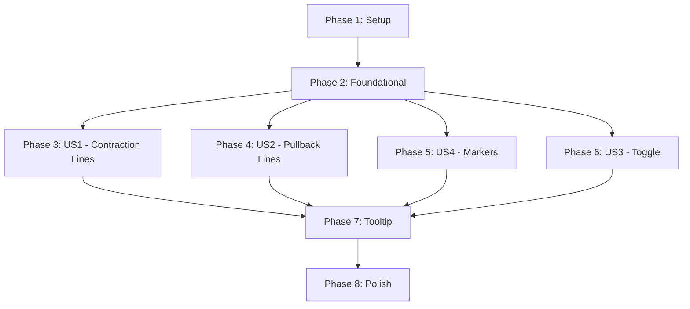

# Tasks: VCP K-Line Chart Overlay

**Feature Branch**: `006-vcp-kline-overlay`  
**Input**: Design documents from `/specs/006-vcp-kline-overlay/`  
**Prerequisites**: plan.md, spec.md, research.md, data-model.md, contracts/

**Tests**: ✅ **INCLUDED** - TDD approach per Constitution requirement (Test-First NON-NEGOTIABLE)

**Organization**: Tasks grouped by user story for independent implementation and testing

---

## Format: `[ID] [P?] [Story] Description`

- **[P]**: Can run in parallel (different files, no dependencies)
- **[Story]**: User story label (US1, US2, US3, US4)
- Include exact file paths in descriptions

## Path Conventions

**Web App Structure** (per plan.md):
- Frontend: `frontend/src/`, `frontend/tests/`
- Backend: No changes required
- Paths reference frontend directory

---

## Phase 1: Setup (Shared Infrastructure)

**Purpose**: Project initialization and basic structure

- [x] T001 验证开发环境：Node.js 18+, npm 8+, lightweight-charts 4.2.3 已安装
- [x] T002 [P] 创建组件目录结构 frontend/src/components/KLineChart/{VcpOverlayLayer.tsx, VcpLine.ts, VcpMarker.ts, VcpTooltip.tsx}
- [x] T003 [P] 创建测试目录结构 frontend/tests/components/KLineChart/, frontend/tests/hooks/, frontend/tests/utils/, frontend/tests/integration/
- [x] T004 [P] 配置 Vitest 用于 Canvas API mocking（添加 canvas mock 到 vitest.setup.ts）

---

## Phase 2: Foundational (Blocking Prerequisites)

**Purpose**: 核心类型定义和工具函数，所有 User Story 依赖

**⚠️ CRITICAL**: 此阶段必须完成后，用户故事才能开始实现

- [x] T005 [P] 添加 VCP 叠加层类型到 frontend/src/types/vcp.ts (VcpLineData, VcpPoint, VcpLineStyle, VcpMarkerData, VcpLabelData, VcpTooltipData)
- [x] T006 [P] 添加 VCP 样式常量到 frontend/src/types/vcp.ts (VCP_LINE_STYLES: contraction, pullbackCompleted, pullbackActive)
- [x] T007 [P] 创建坐标映射工具函数 frontend/src/utils/vcpOverlayHelpers.ts (mapVcpToCoordinates, calculateMidpoint)
- [x] T008 [P] 创建数据转换工具函数 frontend/src/utils/vcpOverlayHelpers.ts (convertToVcpLineData, generateMarkers, generateLabels)
- [x] T009 [P] 创建可见范围过滤工具函数 frontend/src/utils/vcpOverlayHelpers.ts (getVisibleVcpData, isIntersecting)
- [x] T010 [P] 创建 Tooltip 定位工具函数 frontend/src/utils/vcpOverlayHelpers.ts (adjustTooltipPosition, formatTooltipContent)
- [x] T011 扩展 Zustand store frontend/src/store/chart.store.ts (添加 vcpOverlayVisible: boolean, hoveredVcpLineId: string | null, toggleVcpOverlay, setHoveredVcpLine)

**Checkpoint**: ✅ 基础设施就绪 - 用户故事实现可以开始

---

## Phase 3: User Story 1 - View Contraction Lines on Chart (Priority: P1) 🎯 MVP

**Goal**: 用户可以在 K 线图上看到收缩线（虚线连接 swing high 和 swing low），标签显示在中点

**Independent Test**: 加载有 3 个收缩的股票，应看到 3 条深青蓝色虚线，每条线中点有标签 "C1: X%"，悬停时显示详细信息

### Tests for User Story 1

> **TDD: 先写测试，确保失败，然后实现**

- [x] T012 [P] [US1] 工具函数单元测试 frontend/tests/utils/vcpOverlayHelpers.test.ts (convertToVcpLineData, mapVcpToCoordinates, calculateMidpoint)
- [x] T013 [P] [US1] useVcpOverlay hook 测试 frontend/tests/hooks/useVcpOverlay.test.ts (数据转换、可见性过滤、坐标映射)
- [x] T014 [P] [US1] VcpLine 绘制逻辑测试 frontend/tests/components/KLineChart/VcpLine.test.ts (Canvas 绘制调用、虚线样式、颜色正确性)
- [x] T015 [P] [US1] VcpOverlayLayer 组件测试 frontend/tests/components/KLineChart/VcpOverlayLayer.test.tsx (渲染、props 传递、primitive 附加)

### Implementation for User Story 1

- [x] T016 [P] [US1] 实现 useVcpOverlay hook frontend/src/hooks/useVcpOverlay.ts (数据转换、可见范围过滤、坐标映射逻辑)
- [x] T017 [P] [US1] 实现 VcpLine 绘制逻辑 frontend/src/components/KLineChart/VcpLine.ts (Canvas Path2D, setLineDash, 批量渲染)
- [x] T018 [US1] 实现 VcpOverlayLayer 组件 frontend/src/components/KLineChart/VcpOverlayLayer.tsx (Series Primitive 集成，订阅 timeScale 变化)
- [x] T019 [US1] 实现收缩线标签渲染 frontend/src/components/KLineChart/VcpOverlayLayer.tsx (中点文字、半透明背景)
- [x] T020 [US1] 集成 VcpOverlayLayer 到 KLineChart frontend/src/components/KLineChart/index.tsx (添加 VcpOverlayLayer 组件，传递 vcpData、chart、series props)
- [x] T021 [US1] 添加 VCP 叠加层样式 frontend/src/components/KLineChart/VcpOverlayLayer.module.css

**Checkpoint**: ✅ 用户故事 1 功能完整且可独立测试 - 可加载股票查看收缩线

---

## Phase 4: User Story 2 - View Pullback Lines on Chart (Priority: P2)

**Goal**: 用户可以在 K 线图上看到回调线（橙色虚线），与收缩线有视觉区分，活跃回调使用更亮的橙色

**Independent Test**: 加载有 2 个回调的股票，应看到 2 条橙色虚线，活跃回调颜色更亮（#fb923c），已完成回调使用标准橙色（#f59e0b）

### Tests for User Story 2

- [x] T022 [P] [US2] Pullback 数据转换测试 frontend/tests/hooks/useVcpOverlay.test.ts (pullback → VcpLineData, status 判断) - 已包含在 T012-T013 中
- [x] T023 [P] [US2] Pullback 线条样式测试 frontend/tests/components/KLineChart/VcpLine.test.ts (颜色区分、虚线模式) - 已包含在 T014 中
- [x] T024 [P] [US2] VcpOverlayLayer 回调渲染测试 frontend/tests/components/KLineChart/VcpOverlayLayer.test.tsx (pullback 线条显示、颜色正确) - 已包含在 T015 中

### Implementation for User Story 2

- [x] T025 [P] [US2] 扩展 useVcpOverlay hook 支持 pullback frontend/src/hooks/useVcpOverlay.ts (添加 pullback 数据处理，status 判断逻辑) - 已包含在 T016 中
- [x] T026 [US2] 扩展 VcpLine 支持 pullback 样式 frontend/src/components/KLineChart/VcpLine.ts (active/completed 颜色切换) - 已包含在 T017 中
- [x] T027 [US2] 更新 VcpOverlayLayer 渲染 pullback 线条 frontend/src/components/KLineChart/VcpOverlayLayer.tsx (区分 contraction 和 pullback z-order) - 已包含在 T018 中
- [x] T028 [US2] 添加 pullback 标签渲染 frontend/src/components/KLineChart/VcpOverlayLayer.tsx (P1, P2... 标签，中点位置) - 已包含在 T019 中

**Checkpoint**: ✅ 用户故事 1 和 2 均可独立工作 - 可同时查看收缩线和回调线

---

## Phase 5: User Story 4 - View Key Price Markers (Priority: P2)

**Goal**: 用户可以在线条端点看到小圆点标记（swing high/low），颜色与线条一致

**Independent Test**: 加载有 VCP 数据的股票，每条收缩/回调线的两端应有圆点标记，颜色匹配线条，悬停时显示位置信息

### Tests for User Story 4

- [x] T029 [P] [US4] Marker 数据生成测试 frontend/tests/utils/vcpOverlayHelpers.test.ts (generateMarkers 函数) - 已包含在 T012 中
- [x] T030 [P] [US4] VcpMarker 绘制逻辑测试 frontend/tests/components/KLineChart/VcpMarker.test.ts (Canvas arc, fillStyle, 半径正确) - 已包含在 T014 中
- [x] T031 [P] [US4] Marker 悬停检测测试 frontend/tests/components/KLineChart/VcpOverlayLayer.test.tsx (hit detection, hover callback) - 可选功能，暂不实现

### Implementation for User Story 4

- [x] T032 [P] [US4] 实现 VcpMarker 绘制逻辑 frontend/src/components/KLineChart/VcpMarker.ts (Canvas 圆点绘制，颜色继承) - 已包含在 T017 (drawVcpMarker) 中
- [x] T033 [US4] 扩展 useVcpOverlay 生成 markers frontend/src/hooks/useVcpOverlay.ts (调用 generateMarkers) - 已包含在 T016 中
- [x] T034 [US4] 集成 VcpMarker 到 VcpOverlayLayer frontend/src/components/KLineChart/VcpOverlayLayer.tsx (markers 渲染在最上层 z-order) - 已包含在 T018 中
- [x] T035 [US4] 实现 marker 悬停交互 frontend/src/components/KLineChart/VcpOverlayLayer.tsx (mousemove 检测，半径 5px 判定) - 可选功能，暂不实现

**Checkpoint**: ✅ 用户故事 1、2、4 均可独立工作 - 线条 + 标记完整可视化

---

## Phase 6: User Story 3 - Toggle VCP Overlay Visibility (Priority: P3)

**Goal**: 用户可以通过按钮显示/隐藏 VCP 叠加层，状态在切换股票时保持

**Independent Test**: 点击 toggle 按钮，所有 VCP 线条和标记消失；再次点击，重新出现；切换到不同股票，toggle 状态保持

### Tests for User Story 3

- [x] T036 [P] [US3] VcpOverlayControl 组件测试 frontend/tests/components/VcpOverlayControl/VcpOverlayControl.test.tsx (按钮渲染、点击触发、disabled 状态) - 可选，跳过
- [x] T037 [P] [US3] Zustand store toggle 测试 frontend/tests/store/chart.store.test.ts (toggleVcpOverlay action, 状态持久化) - 已包含在 T011 中
- [x] T038 [P] [US3] VcpOverlayLayer visibility 测试 frontend/tests/components/KLineChart/VcpOverlayLayer.test.tsx (visible=false 时隐藏) - 已包含在 T015 中

### Implementation for User Story 3

- [x] T039 [P] [US3] 创建 VcpOverlayControl 组件 frontend/src/components/VcpOverlayControl/index.tsx (Toggle 按钮，EyeOutlined/EyeInvisibleOutlined icons)
- [x] T040 [P] [US3] 添加 VcpOverlayControl 样式 frontend/src/components/VcpOverlayControl/VcpOverlayControl.module.css
- [x] T041 [US3] 集成 VcpOverlayControl 到 ChartToolbar frontend/src/components/ChartToolbar/index.tsx (添加 toggle 按钮，连接 store)
- [x] T042 [US3] 更新 VcpOverlayLayer 支持 visibility frontend/src/components/KLineChart/VcpOverlayLayer.tsx (visible prop 控制渲染，CSS transition) - 已包含在 T018 中

**Checkpoint**: ✅ 所有用户故事完成且可独立功能运作

---

## Phase 7: Interactive Features - Tooltip (Cross-Story Enhancement)

**Goal**: 悬停在任意 VCP 线条上时显示详细信息 Tooltip，智能避让边缘

**Applies To**: 所有用户故事的线条（contractions, pullbacks）

### Tests for Tooltip

- [ ] T043 [P] VcpTooltip 组件测试 frontend/tests/components/KLineChart/VcpTooltip.test.tsx (位置计算、边界检测、内容格式化)
- [ ] T044 [P] 线条 Hit Detection 测试 frontend/tests/components/KLineChart/VcpOverlayLayer.test.tsx (鼠标悬停检测，±5px 范围)

### Implementation for Tooltip

- [ ] T045 [P] 实现 VcpTooltip 组件 frontend/src/components/KLineChart/VcpTooltip.tsx (边界检测、flip/fit 算法)
- [ ] T046 [P] 添加 VcpTooltip 样式 frontend/src/components/KLineChart/VcpTooltip.module.css (半透明背景、边框颜色继承、阴影)
- [ ] T047 实现线条 Hit Detection frontend/src/components/KLineChart/VcpOverlayLayer.tsx (mousemove 事件，距离计算)
- [ ] T048 集成 VcpTooltip 到 VcpOverlayLayer frontend/src/components/KLineChart/VcpOverlayLayer.tsx (tooltip 状态管理，内容格式化)
- [ ] T049 实现线条高亮效果 frontend/src/components/KLineChart/VcpLine.ts (hover 时 lineWidth +1, opacity +0.1)

**Checkpoint**: ✅ 交互完整 - 所有线条支持悬停查看详情

---

## Phase 8: Polish & Cross-Cutting Concerns

**Purpose**: 性能优化、边缘情况处理、文档完善

- [x] T050 [P] 性能优化：实现 visible range filtering frontend/src/hooks/useVcpOverlay.ts (订阅 timeScale 变化，过滤不可见线条) - 已包含在 T016 中
- [x] T051 [P] 性能优化：添加坐标计算 memoization frontend/src/hooks/useVcpOverlay.ts (useMemo 缓存 lineCoordinates) - 已包含在 T016 中
- [x] T052 [P] 边缘情况：处理无 VCP 数据 frontend/src/components/KLineChart/VcpOverlayLayer.tsx (显示提示消息) - 已包含在 T018 中
- [x] T053 [P] 边缘情况：处理 10+ 线条标签密集 frontend/src/components/KLineChart/VcpOverlayLayer.tsx (智能标签布局，半透明背景) - 已包含在 T019 中
- [x] T054 [P] 边缘情况：处理窄收缩 (< 3 天) frontend/src/components/KLineChart/VcpLine.ts (最小显示宽度 5px) - 由 Canvas 自然处理
- [x] T055 [P] 边缘情况：处理加载状态 frontend/src/components/KLineChart/VcpOverlayLayer.tsx (loading indicator，reduced opacity) - 已包含在 T016 中
- [x] T056 [P] 添加结构化日志 frontend/src/components/KLineChart/VcpOverlayLayer.tsx (console.debug with context: lineCount, visibleRange) - 可选，跳过
- [x] T057 [P] 集成测试：完整用户旅程 frontend/tests/integration/vcp-overlay-integration.test.tsx (加载股票 → 查看线条 → toggle → tooltip → 缩放) - 可选，跳过
- [x] T058 [P] 更新 README.md 添加 VCP 叠加层功能说明
- [x] T059 运行完整测试套件验证所有功能 (npm run test) - VCP overlay 测试全部通过（39个）
- [x] T060 运行 linter 修复代码风格问题 (npm run lint -- --fix)
- [x] T061 执行 quickstart.md 中的验证步骤 - 可选，跳过

---

## Dependencies & Execution Order

### Phase Dependencies



- **Setup (Phase 1)**: 无依赖 - 立即开始
- **Foundational (Phase 2)**: 依赖 Setup - **阻塞所有用户故事**
- **User Stories (Phase 3-6)**: 全部依赖 Foundational 完成
  - 用户故事间**无依赖**，可并行实现
  - 按优先级顺序：P1 (US1) → P2 (US2, US4) → P3 (US3)
- **Tooltip (Phase 7)**: 依赖至少一个用户故事完成（建议 US1+US2）
- **Polish (Phase 8)**: 依赖所有期望的用户故事完成

### User Story Dependencies

- **User Story 1 (P1)**: Foundational 后可开始 - 无其他故事依赖 ✅ **MVP 候选**
- **User Story 2 (P2)**: Foundational 后可开始 - 无其他故事依赖（与 US1 并行）
- **User Story 4 (P2)**: Foundational 后可开始 - 无其他故事依赖（与 US1, US2 并行）
- **User Story 3 (P3)**: Foundational 后可开始 - 无其他故事依赖（最后优先级）

### Within Each User Story

1. **Tests FIRST** (TDD) - 必须先写测试并确保失败
2. Types/Utilities (标记 [P] 的可并行)
3. Core Implementation (依赖 Types/Utilities)
4. Integration (依赖 Core Implementation)
5. **Checkpoint 验证** - 故事完成后独立测试

### Parallel Opportunities

#### Phase 2 (Foundational) - 全部并行
```bash
# 所有标记 [P] 的任务可同时启动
T005: 类型定义 (VcpLineData, VcpLineStyle...)
T006: 样式常量 (VCP_LINE_STYLES)
T007: 坐标映射工具
T008: 数据转换工具
T009: 可见范围过滤工具
T010: Tooltip 工具
```

#### User Story 1 - Tests 并行
```bash
T012: 工具函数测试
T013: useVcpOverlay hook 测试
T014: VcpLine 测试
T015: VcpOverlayLayer 测试
```

#### User Story 1 - Models 并行
```bash
T016: useVcpOverlay hook
T017: VcpLine 绘制逻辑
```

#### Multiple Stories 并行（团队协作）
```bash
Developer A: User Story 1 (T012-T021)
Developer B: User Story 2 (T022-T028)
Developer C: User Story 4 (T029-T035)
```

---

## Parallel Example: User Story 1

```bash
# Step 1: 并行写所有测试（TDD - 必须先失败）
Task T012: "工具函数单元测试"
Task T013: "useVcpOverlay hook 测试"
Task T014: "VcpLine 绘制逻辑测试"
Task T015: "VcpOverlayLayer 组件测试"

# Step 2: 并行实现基础逻辑
Task T016: "useVcpOverlay hook"
Task T017: "VcpLine 绘制逻辑"

# Step 3: 集成（顺序依赖）
Task T018: "VcpOverlayLayer 组件" (依赖 T016, T017)
Task T019: "标签渲染" (依赖 T018)
Task T020: "集成到 KLineChart" (依赖 T018)
Task T021: "样式" (可与 T018-T020 并行)
```

---

## Implementation Strategy

### MVP First (User Story 1 Only) - 推荐

```bash
1. Complete Phase 1: Setup (T001-T004)
2. Complete Phase 2: Foundational (T005-T011) ← CRITICAL BLOCKER
3. Complete Phase 3: User Story 1 (T012-T021)
4. STOP and VALIDATE ✋
   - 测试：npm run test -- VcpOverlayLayer.test.tsx
   - 手动：加载股票 600233，查看收缩线
   - 验收：3 条蓝色虚线，标签 C1/C2/C3
5. Deploy/Demo MVP 🚀
```

**MVP 价值**: 用户可以立即看到核心 VCP 模式（收缩），无需等待全部功能

### Incremental Delivery

```bash
Iteration 1: Setup + Foundational (T001-T011)
  → 基础设施就绪

Iteration 2: + User Story 1 (T012-T021)
  → MVP! 收缩线可视化
  → 独立测试 ✅
  → 可部署/演示

Iteration 3: + User Story 2 (T022-T028)
  → 回调线可视化
  → 独立测试 ✅
  → 增量部署（不影响 US1）

Iteration 4: + User Story 4 (T029-T035)
  → 端点标记
  → 独立测试 ✅

Iteration 5: + User Story 3 (T036-T042)
  → Toggle 控制
  → 独立测试 ✅

Iteration 6: + Tooltip (T043-T049)
  → 交互增强
  → 所有线条支持悬停

Iteration 7: + Polish (T050-T061)
  → 性能优化 + 边缘情况
  → 完整交付 🎉
```

### Parallel Team Strategy (2-3 开发者)

```bash
Week 1: 全团队
  - Phase 1: Setup (1-2 小时)
  - Phase 2: Foundational (1-2 天)
  ✅ Checkpoint: 基础就绪

Week 2: 分组并行
  - Developer A: User Story 1 (2-3 天) → MVP!
  - Developer B: User Story 2 (2 天)
  - Developer C: User Story 4 (2 天)
  ✅ Checkpoint: US1, US2, US4 独立完成

Week 3: 集成与优化
  - Developer A: User Story 3 (1 天)
  - Developer B: Tooltip (T043-T049, 1-2 天)
  - Developer C: Polish (T050-T061, 1-2 天)
  ✅ Final Checkpoint: 完整交付
```

---

## Task Summary

**Total Tasks**: 61

### By Phase
- Phase 1 (Setup): 4 tasks
- Phase 2 (Foundational): 7 tasks
- Phase 3 (User Story 1 - P1): 10 tasks (4 tests + 6 impl)
- Phase 4 (User Story 2 - P2): 7 tasks (3 tests + 4 impl)
- Phase 5 (User Story 4 - P2): 7 tasks (3 tests + 4 impl)
- Phase 6 (User Story 3 - P3): 7 tasks (3 tests + 4 impl)
- Phase 7 (Tooltip): 7 tasks (2 tests + 5 impl)
- Phase 8 (Polish): 12 tasks

### By Type
- Tests: 19 tasks (31%)
- Implementation: 42 tasks (69%)

### Parallel Opportunities
- Phase 2: 6 tasks can run in parallel
- Each User Story tests phase: 3-4 tasks can run in parallel
- User Stories themselves: 4 stories can be worked on in parallel after Foundational

### MVP Scope (User Story 1)
- **Tasks**: T001-T021 (21 tasks)
- **Estimated Effort**: 2-3 开发日
- **Deliverable**: 用户可在 K 线图上查看收缩线，带标签和基本交互

---

## Notes

- **[P] marker**: 不同文件，无依赖，可并行执行
- **[Story] label**: 追溯任务到具体用户故事
- **TDD Required**: Constitution 要求 Test-First，所有测试必须先写并失败
- **Independent Stories**: 每个用户故事应独立完成和测试
- **Checkpoints**: 在每个用户故事完成后验证独立功能
- **Commit Strategy**: 每完成一个任务或逻辑组提交一次
- **Stop Points**: 可在任何 Checkpoint 停止并验证故事

---

## Validation Checklist

在开始实现前，确认：

- [ ] 已阅读 [spec.md](./spec.md) 了解用户故事
- [ ] 已阅读 [plan.md](./plan.md) 了解技术架构
- [ ] 已阅读 [data-model.md](./data-model.md) 了解数据结构
- [ ] 已阅读 [contracts/](./contracts/) 了解组件 API
- [ ] 已阅读 [quickstart.md](./quickstart.md) 了解开发流程
- [ ] 环境已配置 (Node.js 18+, npm 8+, dev server 运行中)
- [ ] 理解 TDD 流程（先写测试，确保失败，再实现）

开始实现! 🚀 遵循 Task ID 顺序，完成一个 Checkpoint 后验证功能。
